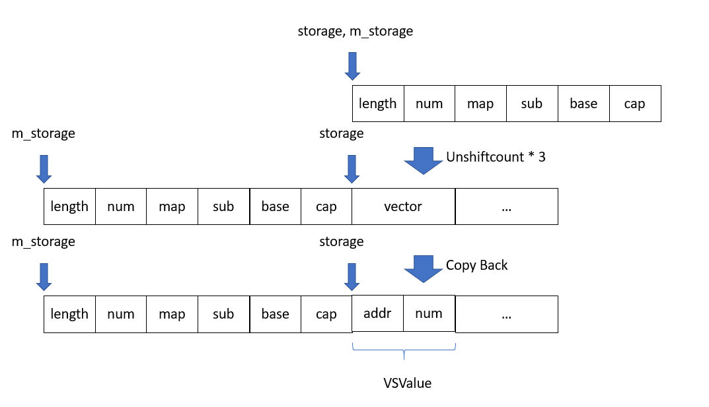

# Tesla hacking 2016

## Tesla Model S

[Tesla hardware infomation](https://www.pentestpartners.com/security-blog/reverse-engineering-tesla-hardware/)


- CID (Central Information Display) – the large console at the center of the dash
- IC (Instrument Cluster)
- Conventional CAN connected ECUs
- ECU (Electronic Control Unit)
- CAN - Controller Area Network
- VCM (Visual Computer Module)


## Tested Tesla  information

Tested model: Model S

software version: v7.1(2.32.23)

User Agent of web browser: Mozilla/5.0 (X11; Linux) AppleWebKit/534.34 (KHTML, like Gecko) QtCarBrowser Safari/534.34",

## Vulnerability in Browser

**WebKit**: A open source web browser engine

From the version of User Agent, it can be deduced that the version of QtWebKit is 2.2.x.

[source of QtWebKit 2.2](https://github.com/NNemec/qtwebkit-2.2)

### ArrayStorage

`ArrayStorage` is a type which holds the actual data values of an array. There may be space before `ArrayStorage` for quick unshift / shift operation.

path: `qtwebkit-2.2/Source/JavaScriptCore/runtime/JSArray.h`


It may be stored like this in memory.


### ShiftCount and UnShiftCount

**ShiftCount**: Pop some element in the vector and move array to right. Precisely, the array shift size of `JSValue` * number of removed element.


**UnShiftCount**: Pop some element in the vector and move array to left. Precisely, the array shift size of `JSValue` * number of removed element. In addition, if count larger than free space before the array, it will move to new place.


### JSValue structure

Path: `qtwebkit-2.2/Source/JavaScriptCore/runtime/JSValue.h`


### Vulnerability in JSArray::sort

Function path: `qtwebkit-2.2/Source/JavaScriptCore/runtime/JSArray.cpp`

`JSArray::sort` mainly do following things:

1. Copy elements from storage into `AVLTree`(avltree?)
2. Call `compareFunction` for sorting
3. Copy sorted element back in storage

```c
void JSArray::sort(ExecState* exec, JSValue compareFunction, CallType callType, const CallData& callData) 
{ 
    checkConsistency(); 
    ArrayStorage* storage = m_storage; // local variable cause the vulnerability
    ...... 
    // Copy the values back into m_storage. 
    AVLTree<AVLTreeAbstractorForArrayCompare, 44>::Iterator iter; 
    iter.start_iter_least(tree); 
    JSGlobalData& globalData = exec->globalData(); 
    for (unsigned i = 0; i < numDefined; ++i) 
    { 
        // Vulnerability 1
        storage->m_vector[i].set(globalData, this, 
                                 tree.abstractor().m_nodes[*iter].value); 
        ++iter; 
    } 
    ......
    // Vulnerability 2
    storage->m_numValuesInVector = newUsedVectorLength; 
    ......
}
```

The vulnerability is that if `compareFunction` is shift function, `JSArray::shiftCount()` or `JSArray::unshiftCount()`, the length of the m_vector will be changed, also the entire m_vector structure will be shifted to another place. However, the local variable pointer storage still points to the old location, result in memory corruption.


## Exploit Vulnerability in Browser

### Leaking JSCell address

Because of `Vulnerablity 2` in `JSArray::sort`, some cell can be overlapped with `m_numValueInVector`. Since *true address can be got after exploit the payload of `JSvalue`*,   we can overlap `tag` in `JSValue` with `num`. Then, the address can be targeted by finding the double value.



### Free Storage at any Address

Because `m_allocBase` points to the head address of the array,  the target address can be got. In addition, by using the feature of `unshiftcount` , the space, which cannot contain the array because of many times of unshift operation, will be free. So, it is easy to free storage by following step:

1. shift the array so that the `m_allocBase` can be overlapped with `payload` in an `JSValue` element.
2. unshift the same array until `increaseVectorPrefixLength` is triggered.

However, there are some bugs when calling sort if we do so.


The local value `storage` find the map is not equal to zero after shift, and execute this statement `map->size()` which may cause crush. (`map` is actually the `m_length` of `m_storage`)

To solve this, we can unshift the array and overlap the `m_length` with zero. Fortunately, there is no assert about `m_length`.


Then by using Use After Free the pointer, the old space can be used.

Now, we can get the array address and arbitrarily allocate and free space


## CVE-2011-3928

`copyNonAttributeProperties` is unsafe when calling `static_cast`

Path: `qtwebkit-2.2/Source/WebCore/html/HTMLInputElement.cpp`

`qtwebkit-2.2/SourceWebcore/dom/InputElement.cpp`

`qtwebkit-2.2/Source/JavaScriptCore/wtf/text/StringImpl.h`


## CVE-2013-6282

BSP(Board Support Package):  containing hardware-specific drivers and other routines that allow a particular operating system (traditionally a real-time operating system, or RTOS) to function in a particular hardware environment (a computer), integrated with the RTOS itself. 

The (1) get_user and (2) put_user API functions in the Linux kernel before 3.5.5 on the v6k and v7 ARM platforms do not validate certain addresses, which allows attackers to read or modify the contents of arbitrary kernel memory locations via a crafted application.


